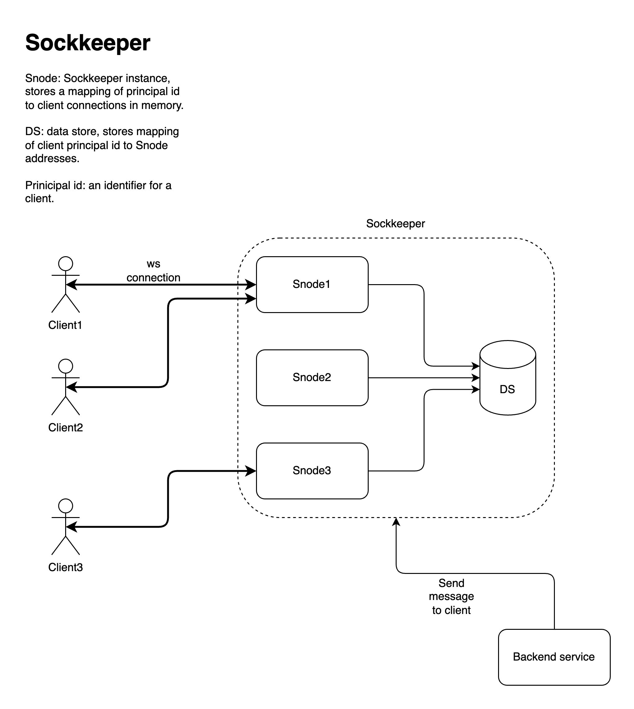

## Sockkeeper
A distributed client connection manager.

- Keeps track of client socket connections.
- Forwards messages from backend services to connected clients.
  
## Design


## APIs
### Accept client connection

protocol: ws <br> uri: /connect/{principal_id}

`ws://localhost:8888/connect/santanukar`

### Send message to client 
protocol: http <br> uri: /send <br> method: POST

`POST http://localhost:8888/sendMessage`


Body:

```
    {
        "principal": {
            "id": "santanukar"
        },
        "message": "{\"text\":\"Hello, world!\"}"
    }
```


